# 🐍 Desafio: Hora da Prática - Python para Dados

> Desafio proposto pelo plano de carreira em Análise de Dados pela Alura, estudo de Python para Dados: primeiros passos.

Neste repositório, você encontra as soluções para os exercícios práticos focados no uso de variáveis, função `input`, operadores matemáticos e manipulação de strings (textos) em Python.

## 📂 Arquivos do Projeto

- `desafio.py`: Arquivo contendo todo o código-fonte desenvolvido para resolver as questões.
- `imagens/`: Pasta com as capturas de tela demonstrando a execução de cada código.

---

## 🚀 Resultados dos Desafios

Abaixo estão listados os exercícios resolvidos separados por categoria, acompanhados das imagens demonstrando a execução e o resultado de cada código.

### 📊 1. Coleta e amostragem de dados

**1.** Crie um programa que solicite à pessoa usuária digitar seu nome, e imprima “Olá, [nome]!”.
 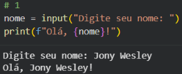

**2.** Crie um programa que solicite à pessoa usuária digitar seu nome e idade, e imprima “Olá, [nome], você tem [idade] anos.”.
 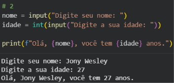

**3.** Crie um programa que solicite à pessoa usuária digitar seu nome, idade e altura em metros, e imprima “Olá, [nome], você tem [idade] anos e mede [altura] metros!”.
 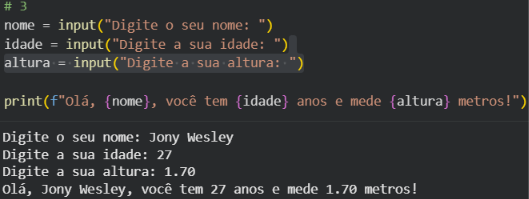

---

### 🧮 2. Calculadora com operadores

**1.** Crie um programa que solicite dois valores numéricos à pessoa usuária e imprima a soma dos dois valores.
 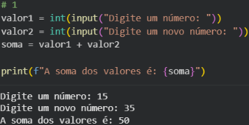

**2.** Crie um programa que solicite três valores numéricos à pessoa usuária e imprima a soma dos três valores.
 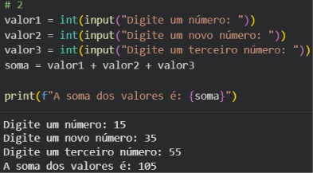

**3.** Crie um programa que solicite dois valores numéricos à pessoa usuária e imprima a subtração do primeiro pelo o segundo valor.
 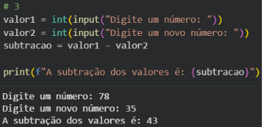

**4.** Crie um programa que solicite dois valores numéricos à pessoa usuária e imprima a multiplicação dos dois valores.
 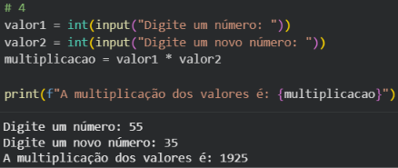

**5.** Crie um programa que solicite dois valores numéricos, um numerador e um denominador, e realize a divisão entre os dois valores. Deixe claro que o valor do denominador não pode ser 0.
 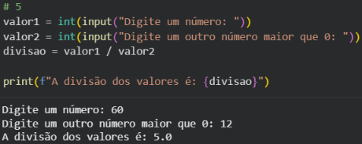

**6.** Crie um programa que solicite dois valores numéricos, um operador e uma potência, e realize a exponenciação entre esses dois valores.
 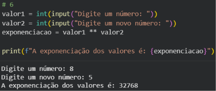

**7.** Crie um programa que solicite dois valores numéricos, um numerador e um denominador e realize a divisão inteira entre os dois valores. Deixe claro que o valor do denominador não pode ser 0.
 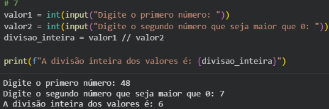

**8.** Crie um programa que solicite dois valores numéricos, um numerador e um denominador, e retorne o resto da divisão entre os dois valores. Deixe claro que o valor do denominador não pode ser 0.
 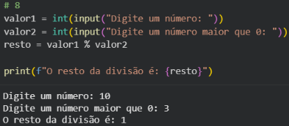

**9.** Crie um código que solicita 3 notas de um estudante e imprima a média das notas.
 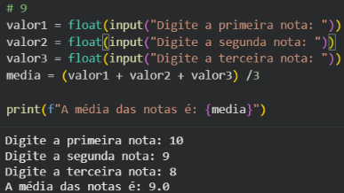

**10.** Crie um código que calcule e imprima a média ponderada dos números 5, 12, 20 e 15 com pesos respectivamente iguais a 1, 2, 3 e 4.
 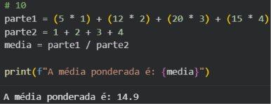

---

### 📝 3. Editando textos

**1.** Crie uma variável chamada “frase” e atribua a ela uma string de sua escolha. Em seguida, imprima a frase na tela.
 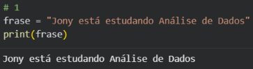

**2.** Crie um código que solicite uma frase e depois imprima a frase na tela.
 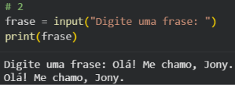

**3.** Crie um código que solicite uma frase à pessoa usuária e imprima a mesma frase digitada mas com todas as letras maiúsculas.
 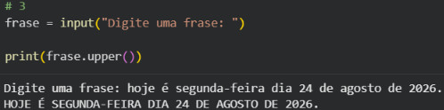

**4.** Crie um código que solicite uma frase à pessoa usuária e imprima a mesma frase digitada mas com todas as letras minúsculas.
 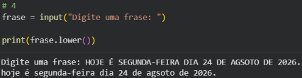

**5.** Crie uma variável chamada “frase” e atribua a ela uma string de sua escolha. Em seguida, imprima a frase sem espaços em branco no início e no fim.
 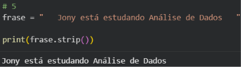

**6.** Crie um código que solicite uma frase à pessoa usuária e imprima a mesma frase sem espaços em branco no início e no fim.
 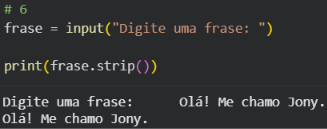

**7.** Crie um código que solicite uma frase à pessoa usuária e imprima a mesma frase sem espaços em branco no início e no fim e em letras minúsculas.
 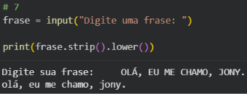

**8.** Crie um código que solicite uma frase à pessoa usuária e imprima a mesma frase com todas as vogais “e” trocadas pela letra “f”.
 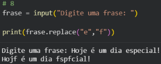

**9.** Crie um código que solicite uma frase à pessoa usuária e imprima a mesma frase com todas as vogais “a” trocadas pela caractere “@”.
 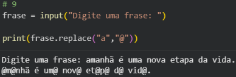

**10.** Crie um código que solicite uma frase à pessoa usuária e imprima a mesma frase com todas as consoantes “s” trocadas pelo caractere “$”.
 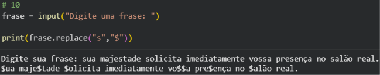

---
*Desenvolvido por Jony durante os estudos de Análise de Dados.*
